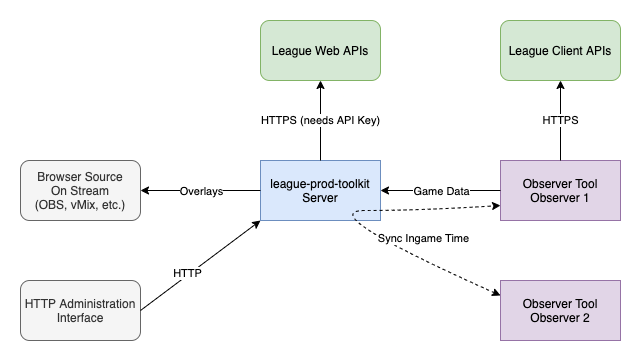

# league-prod-toolkit

## What's the state of this?
**While we are still working on this, most features are functional.**

## Features
- Custom champion select overlay (implementation of our stand-alone tool [here](https://github.com/RCVolus/lol-pick-ban-ui))
- Ingame overlay with animations for item purchases and level ups
- Track matchups and automatically update ingame overlays and pause screens
- Postgame stats (pick order, item builds, damage graphs, gold graph, and more)

## Requirements
- Champion Select / ingame overlays require our [Observer Tool](https://github.com/RCVolus/league-observer-tool) to send game data
- Some features require a Riot API Key

## Installation & Docs
**[Head over to the Wiki](https://github.com/RCVolus/league-prod-toolkit/wiki)**

## Architecture/Sample setup
This shows the prod toolkit running on a dedicated server, with observer PCs sending data and overlays integrated into OBS/vMix with a browser source.



Legend:
- Magenta - Clients running the observer tool
- Blue - The prod-toolkit
- Green - An external API that is being connected to
- Grey - Prod-toolkit interfaces

## Developing
This section contains information about how to locally run and extend the toolkit.

### Building modules
To make sure all the modules are correctly built and installed, use the following command:

```
npm run build:modules
```

This will make sure that all modules are installed and built correctly. If you want to only run for a single module, have a look at the folder name of the module, and then run:

```
npm run build:modules static-league
```

### Setting up git hooks
In order to set up a git pre-commit hook, that will make sure that the code style conforms to the guideline before you commit, run:

```
npm run setuphooks
```
